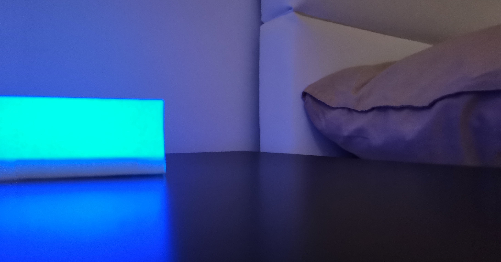
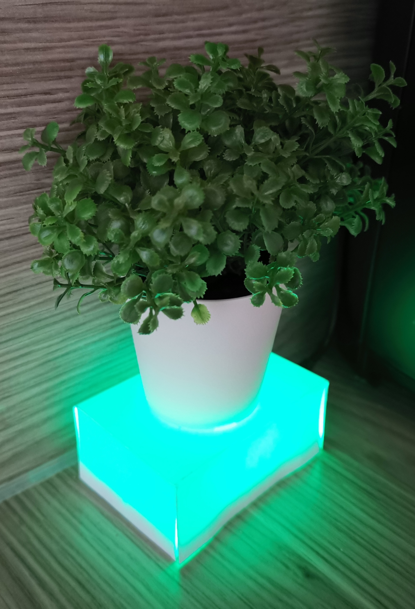
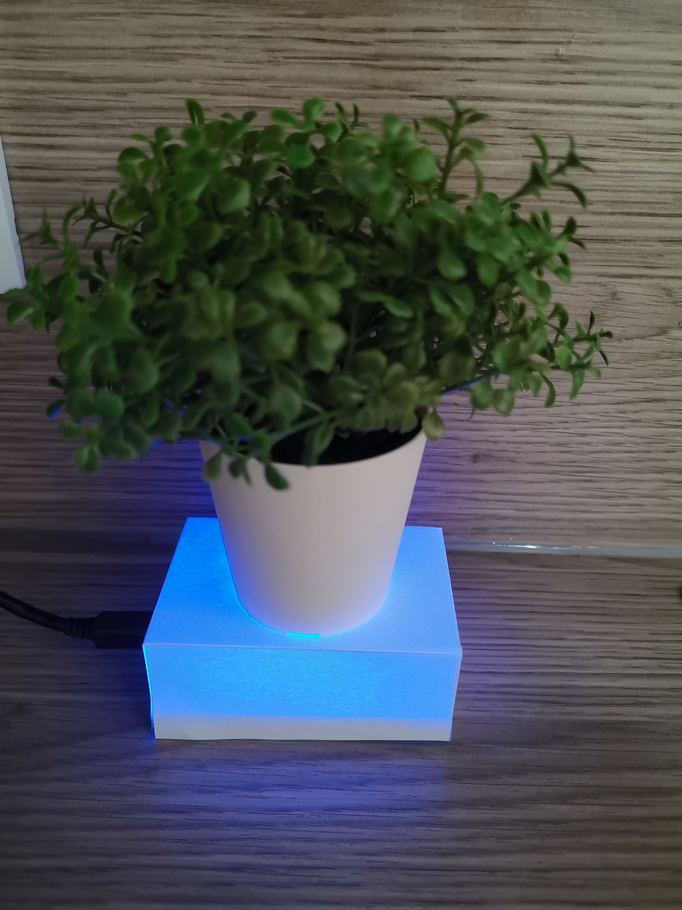

# SugarLight

SugarLight is a hard- and software project to demonstrate how to enhance the sleep of type-1 diabetics by providing them with an easy and non-disturbing interface to check some of their relevant Nightscout data when they wake up - without checking their phone or moving a muscle. It is an easy and lightweight version of my project SugarBeam to provide an even simpler interface.

## Disclaimer
**CURRENTLY THIS PROJECT ONLY SUPPORTS NIGHTSCOUT PAGES SET TO MG/DL UNIT!**

SugarLight was developed for educational purpose only. Everything you do with the presented knowledge or code is your responsibility. DO NOT use this project for medical purpose or treatment decisions! This repository is not affiliated with Nightscout, Dexcom or any other company, just a hobby project to serve as an inspiration for what Nightscout enables us to do.

This repository is in a very early development stage and bugs will occure. Do not rely on it and please help making it better :)

## How it works

           |  
:-------------------------:|:-------------------------:
Value in range| High value

SugarLight runs on an ESP8266 NodeMCU Board which allows you to connect to the internet. It regularly makes a call to the API of a Nightscout site and the World Time API to check the timestamp of the Nightscout data. When all data is loaded it will display it in the form of differently colored light and wait until there may be new data to fetch.

If the light is blinking, the delta value from the Nightscout site is above a positive or below a negative threshold (the glucose value is rising or sinking fast). You can customize the threshold or turn this feature off in the program code. Be aware that currently, SugarLight uses the 'delta' value given by the API, not the difference between the last two glucose values.

## What you need
**PREREQUISITES**
- A Nightscout site ([Click here to see what Nightscout is](http://www.nightscout.info/))

**HARDWARE**
- An ESP8266 NodeMCU Board ([Amazon link to my board](https://www.amazon.de/gp/product/B07DRF9YTV/ref=ppx_yo_dt_b_asin_title_o02_s00?ie=UTF8&psc=1))
- A common anode RGB LED (you can also use a common cathode LED but you will need to remove all the __1023-__ in __void showColor__ and wire the common pin to ground)
- Resistors that fit your LED
- A breadboard (or wires and a soldering iron)
- A computer to program the board and a micro USB cable to connect it 
- A strong piece of paper, scissors and double-sided tape 

**SOFTWARE**  
- The Arduino IDE ([Download](https://www.arduino.cc/en/main/software))
- The driver for the board ([Download](https://www.silabs.com/products/development-tools/software/usb-to-uart-bridge-vcp-drivers))
- All libraries used in the code ([How to install Arduino libraries](https://www.arduino.cc/en/Guide/Libraries))

## Build
You build the hardware of this project by just connecting the RGB LED to the board. Since this repository is only there for testing, I just used a breadboard to do so. I connected the red cathode of my led to pin **D0**, the green to **D1** and the blue one to **D2**. You can change the pins in the program later on, just be sure that your board supports PWM for all digital output pins used. The common anode is connected to the 3.3V supply of the board. That's it, we are done. 

You may also want to twist your LED a little bit to the center of your breadboard, so you can put a paper housing around it. This will make the light of the LED softer. I just marked the size of my breadboard to make a little box with 2.5 cm (~ 1 inch) height that fits on top. Don't forget to make a little cutout for the micro USB plug of the board.

You should also cover the small LEDs on the Board (two in my case) so you do not get confused by the blue color they may emmit.

## Programs
**Do not just copy and paste the code!** Since this is an educational project you need to be able to understand everything you do and load onto your board. If you have any question feel free to reach out.

There are **2 versions** of the program. 
1) **static.ino** - One has fixed boundaries which change the color of the LED. By default, this program changes the color to red for low, green for in-range and blue for high.  
2) [COMMING SOON] **fading.ino** The second program mixes the colors inbetween so for example if you are on the higher side of "in range" the color will become teal.

## Configuration
**WIFI SETTINGS**  
- `WIFI_NAME`: Name of your WIFI-Network
- `WIFI_PASSWORD`: Password of your WIFI-Network

**NIGHTSCOUT API**  
- `NIGHTSCOUT_URL`: The URL to the Nightscout page, without a / at the end. Don't forget the https:// at the beginning if you are using SSL (recommended).
- `NIGHTSCOUT_TOKEN`: The token to the Nightscout page. You get it by opening the burger menu on the Nightscout page, then creating a new subject with a read-only role. The string you need to copy and paste inside the quotes will look something like this: `yourname-1345cdw234eder31`
- `NIGHTSCOUT_USE_SSL`: Set true if you are using SSL (https://) when calling the Nightscout API (recommended)
- `NIGHTSCOUT_SHA1`: If you are using SSL, you will need to provide the SHA1 fingerprint here. There are multiple simple ways to get this value from your Nightscout page. You can Google it or just navigate to the https version of the Nightscout page with your Chrome browser, then press the Lock Icon > Certificate > Details and at the very bottom your SHA1 fingerprint should look like this: `4B 57 1E 3A 8D 3C D9 34 C0 F8 58 7D 8E B3 BF CB 36 A6 9F 73`

**LED PINS**
- `PIN_R`: The pin to the red cathode of your RGB LED
- `PIN_G`: The pin to the green cathode of your RGB LED
- `PIN_B`: The pin to the blue cathode of your RGB LED

**RANGE COLORS**  
All color values are stored in arrays with values from 0 to 1023. Each element corresponds to a pin / primary color. Examples: {1023,0,0} is primary red, {0,1023,1023} is bluegreen. Colors may vary with your hardware.
- `COLOR_LOW`: Color when value is under `LIMIT_LOW`
- `COLOR_IN_RANGE`: Color when value is in range
- `COLOR_HIGH`: Color when value is above `LIMIT_HIGH`
- `DIM_FACTOR`: Choose between 0.05 (dark) and 1 (bright) to adjust the brightness of your LED

**VALUE LIMITS**  
- `LIMIT_HIGH`: Border in mg/dl, when `COLOR_HIGH` / `COLOR_IN_RANGE` should be set
- `LIMIT_LOW`: Border in mg/dl, when `COLOR_LOW` / `COLOR_IN_RANGE` should be set
- `USE_DELTA`: Set to false if you don't want the LED to blink on delta changes.
- `DELTA_THRESHOLD`: At which (mg/dl) delta value the LED should start to blink. It automatically takes into account positive and negative values. Be aware that currently, SugarLight uses the 'delta' value given by the API, not the difference between the last two glucose values.

**TECHNICAL VALUES**
- `BLINK_SPEED`: The speed at which the LED flashes. This does not affect the initial white blinking. Choose between 1 to 10, otherwise, it might break the program.
- `REFRESH_RATE`: Minimum time between API calls (in milliseconds)
- `JSON_DOC_SIZE`: Size of the document to store API JSON data. ([see ArduinoJson Documentation](https://arduinojson.org/v6/doc/))
- `OLD_VALUE_THRESHOLD`: If a dataset has a timestamp that is older than this value (in seconds), no light should be displayed
- `NS_UPDATE_CYCLE`: The time of the sensor pause + the time your uploader needs to get the data to Nightscout (in milliseconds). Increase this value if SugarLight always gets an old value on the next call after the long pause, your upload method might just be slower than mine.

**TIME API**  
You probably don't want to change these settings as long as the Time API is working. Currently, this project is using the [World Time API](https://worldtimeapi.org/).
- `TIME_API_URL`: URL of the Time API
- `TIME_API_USE_SSL`: True if you are using SSL (https) with the Time API (recommended)
- `TIME_API_SHA1`: The SHA1 fingerprint of the Time API URL

## Planned enhancements
These are some of the features that definitely need to be worked on. It is not a complete list and there is no ranking applied.
- Making a real housing out of aluminum and frosted glass
- Adding a color fade program to have more distinction
- Better state management
- Better memory management
- Put settings and credentials into a separate file
- Trace bug: Reconnecting to unstable Nightscout site
- Allow separate dim or range settings for different times of the day

## License

The license for this project is based on GNU General Public License v2.0 but there are **further restrictions** for safety reasons. You can find the license in [LICENSE.md](https://github.com/Schimpi/SugarLight/blob/master/LICENSE.md).
